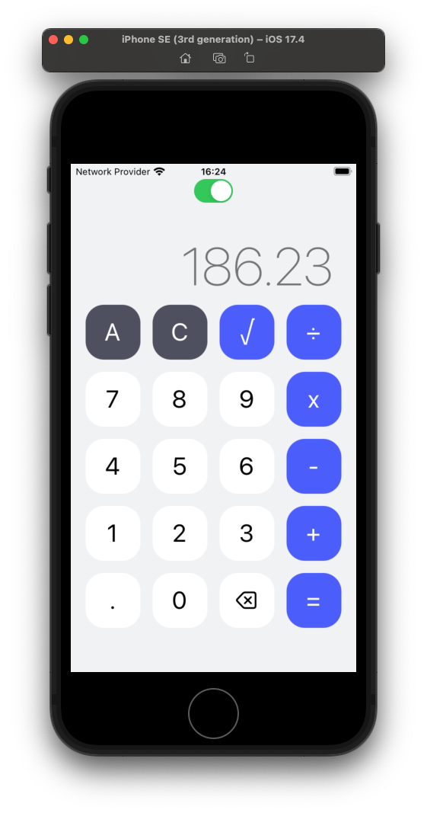
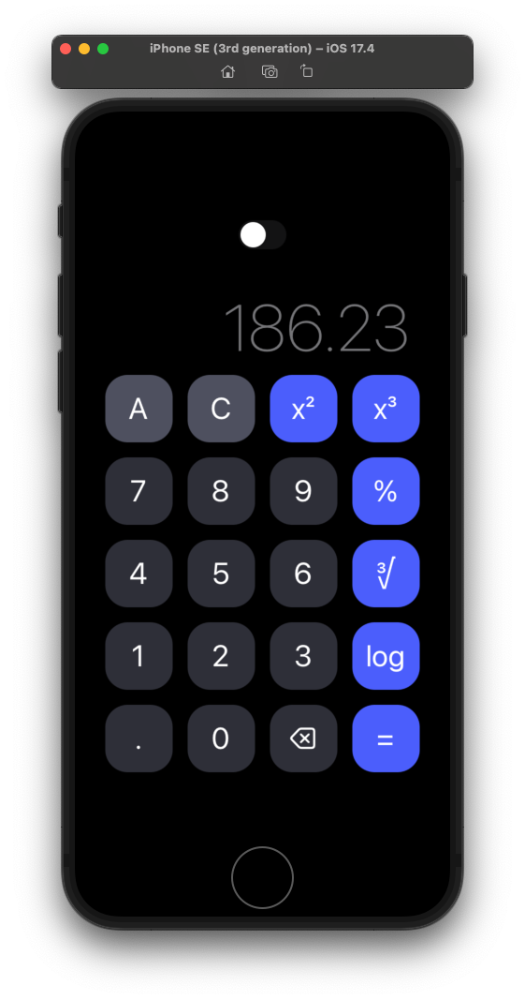

<h1 align="center">Calculator</h1>

<div align="center" style="display: flex; align-items: center; justify-content: center">


</div>

## Resources

User interface is written in `TypeScript` using the `React Native` framework.

Frontend building tool is handled by [Expo](https://expo.dev/)

## Features

Calculator app with a theme change feature. <br />
Supported operations:
- adding
- subtraction
- multiplication
- division
- square rooting
- compounding
- modulo
- logarithm


## Running from sources

```bash
git clone https://github.com/kamilkaminski01/calculator.git
cd calculator/
npm install
npm run start
```

The web version will be available at `localhost:8081`

